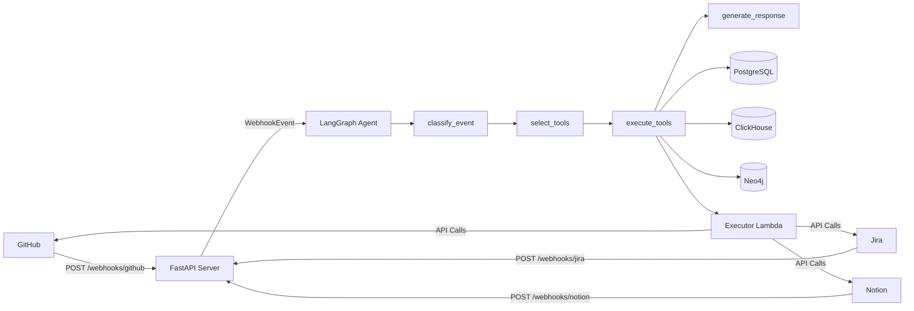

# Webhook to Agent Architecture - Quick Reference

## System Diagram



## Files Created

| File | Purpose |
|------|---------|
| [`webhook_server.py`](file:///c:/PF/Projects/DataThon-2/webhook_server.py) | FastAPI server with 3 webhook endpoints |
| [`agent/schemas/webhook_schemas.py`](file:///c:/PF/Projects/DataThon-2/agent/schemas/webhook_schemas.py) | WebhookEvent and related Pydantic schemas |
| [`test_webhooks.py`](file:///c:/PF/Projects/DataThon-2/test_webhooks.py) | Test script with sample payloads |
| [`Docs/WEBHOOK_SERVER_GUIDE.md`](file:///c:/PF/Projects/DataThon-2/Docs/WEBHOOK_SERVER_GUIDE.md) | Complete setup & deployment guide |

## Files Modified

| File | Changes |
|------|---------|
| [`agent/agent.py`](file:///c:/PF/Projects/DataThon-2/agent/agent.py) | KafkaEvent → WebhookEvent |
| [`agent/config.py`](file:///c:/PF/Projects/DataThon-2/agent/config.py) | Added webhook secrets config |
| [`.env.example`](file:///c:/PF/Projects/DataThon-2/.env.example) | Added webhook configuration |
| [`requirements.txt`](file:///c:/PF/Projects/DataThon-2/requirements.txt) | Added FastAPI + uvicorn |

## Quick Start

```bash
# 1. Install dependencies
pip install -r requirements.txt

# 2. Configure .env
GITHUB_WEBHOOK_SECRET=$(python -c "import secrets; print(secrets.token_urlsafe(32))")

# 3. Start server
python webhook_server.py

# 4. Test locally
python test_webhooks.py

# 5. Expose with ngrok (for real webhooks)
ngrok http 8000
```

## Webhook Endpoints

- **GitHub**: `POST /webhooks/github` (HMAC SHA-256 validation ✅)
- **Jira**: `POST /webhooks/jira`
- **Notion**: `POST /webhooks/notion`
- **Health**: `GET /`

## Architecture Benefits

✅ **No Kafka** - Simpler, cheaper, easier to test  
✅ **Direct Processing** - <100ms latency  
✅ **Same Agent Workflow** - No changes to LangGraph logic  
✅ **Bi-directional Sync** - Executor tools still work  

## Security

- ✅ GitHub: HMAC SHA-256 signature validation
- ⚠️ Jira/Notion: Use IP allowlist or VPN
- 🔒 HTTPS required for production
- 🔐 Rotate secrets periodically

## Testing

```bash
# Run test suite
python test_webhooks.py

# Expected output:
✅ Health check: 200 OK
🔵 GitHub webhook: 200 OK (4 tools executed)
🟠 Jira webhook: 200 OK
🟣 Notion webhook: 200 OK
```

## Next Steps

1. **Configure .env** with webhook secrets
2. **Start server** locally
3. **Test** with test_webhooks.py
4. **Deploy** to AWS Lambda or Docker
5. **Configure webhooks** in GitHub/Jira/Notion

See [WEBHOOK_SERVER_GUIDE.md](file:///c:/PF/Projects/DataThon-2/Docs/WEBHOOK_SERVER_GUIDE.md) for complete documentation.
