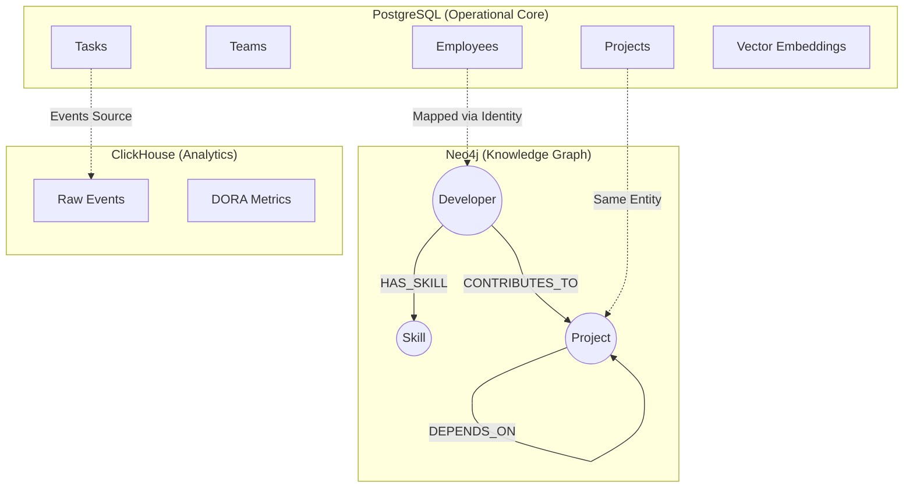

# 🏗️ Engineering Intelligence Platform: Data Architecture

This document provides a comprehensive overview of the data landscape for the Engineering Intelligence Platform. We utilize a **Polyglot Persistence** architecture, leveraging the best-in-class database for each specific data shape (Relational, Graph, and Time-Series).

## 🧩 High-Level Architecture

---

## 1. PostgreSQL (The Source of Truth)
**Type:** Relational + Vector Database
**Extensions:** `pgcrypto`, `vector`

PostgreSQL serves as the primary operational store. It handles strict data integrity, transactional consistency, and stores vector embeddings for RAG (Retrieval-Augmented Generation).

### 🔑 Key Domains
| Domain | Description | Key Entities |
| :--- | :--- | :--- |
| **Organization** | Structure of the company. | `teams` (recursive), `employees` (details + rates) |
| **Work Management** | Execution tracking. | `projects`, `tasks` (Jira/Linear sync), `sprints` |
| **Finance** | Budgeting and costs. | `financial_metrics`, `project_budgets` |
| **AI Memory** | Semantic understanding. | `embeddings` (1024-dim vectors for tasks/docs) |

### 💡 Highlight: Vector Search
The `embeddings` table uses `pgvector` with an **HNSW index** for millisecond-latency semantic search, powering the AI agent's ability to "remember" past context.

---

## 2. Neo4j Aura (The Knowledge Graph)
**Type:** Property Graph Database

Neo4j models the complex, interconnected web of relationships that a relational DB struggles to query efficiently. It answers questions like *"Who is the best person to fix this bug based on past work?"*.

### 🕸️ Graph Schema
- **Nodes**:
    - `Developer`: Represents a team member.
    - `Skill`: Represents a technology (e.g., "React", "Python").
    - `Project`: Represents a codebase or initiative.
- **Relationships**:
    - `(:Developer)-[:CONTRIBUTES_TO]->(:Project)`
    - `(:Developer)-[:HAS_SKILL]->(:Skill)`
    - `(:Project)-[:DEPENDS_ON]->(:Project)`

---

## 3. ClickHouse (The Metrics Engine)
**Type:** Columnar OLAP Database

ClickHouse handles high-velocity event streams and real-time analytics. It is optimized for aggregations, making it the engine behind our live dashboards.

### 📊 Data Tables
| Table | Purpose | Optimized For |
| :--- | :--- | :--- |
| **`events`** | Immutable log of every action (PR merged, Ticket closed). | High-throughput ingestion. |
| **`dora_daily_metrics`** | Pre-computed DevOps metrics (Deployment Freq, Lead Time). | Instant dashboard loading. |

---

## 🔗 Data Integration Strategy
*   **Identity Mapping**: The `identity_mappings` table in Postgres links a single `employee_id` to multiple external personas (GitHub username, Jira email), allowing us to correlate activities across platforms.
*   **Polyglot Linking**: While data lives in separate stores, it is logically unified by consistent IDs (UUIDs) and entity names (Project Keys).
