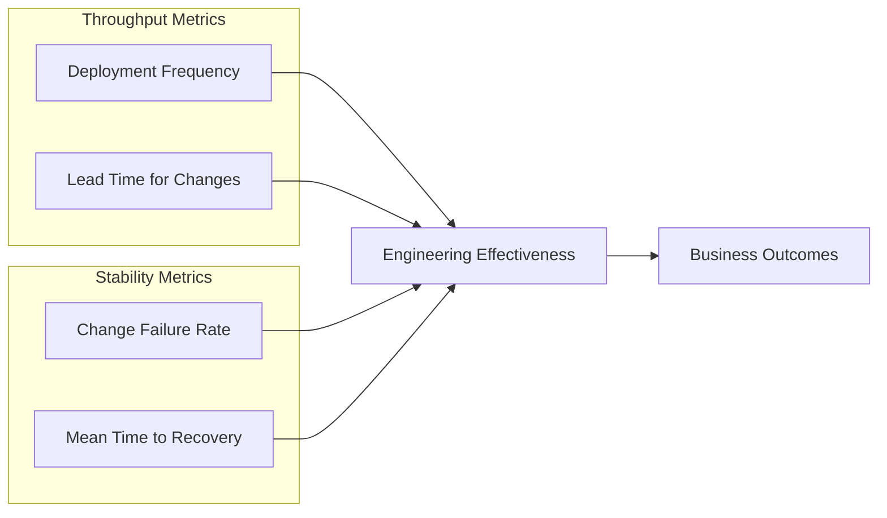
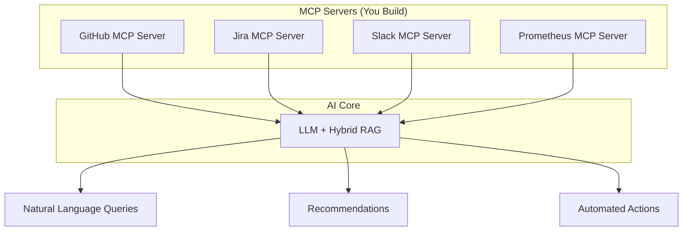
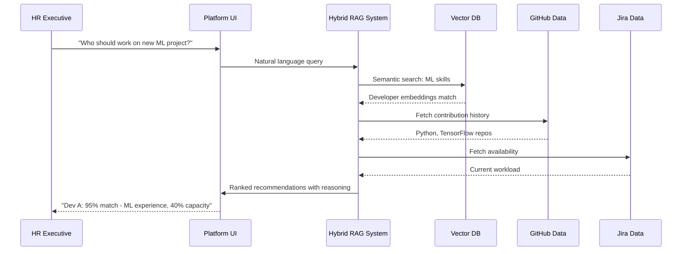

# AI-Driven Enterprise Delivery & Workforce Intelligence: Deep Analysis

> **Hackathon Problem Statement Analysis and Implementation Strategy**

---

## Executive Summary

This problem statement asks you to build an **Engineering Intelligence Platform (EIP)** that bridges the gap between raw technical signals (commits, PRs, deployments, task execution) and high-level business metrics (delivery health, cost efficiency, productivity, workforce utilization). Think of it as **building a "Google Analytics for Engineering Organizations"** where the platform consumes engineering telemetry and produces executive-ready business intelligence.

---

## 1. PS Breakdown: What They're REALLY Asking For

### Core Requirements (Prioritized)

| Priority | Requirement | What It Means |
|----------|-------------|---------------|
| 🔴 **P0** | Convert raw engineering activity → business insights | Ingest commits, PRs, Jira tickets, deployments → Output: "Project X is 3 weeks behind, costing $50K extra" |
| 🔴 **P0** | Multi-persona dashboards | Engineering Lead sees DORA metrics; CFO sees cost burn; HR sees utilization rates |
| 🟠 **P1** | Scale across large organizations | Handle 1000+ engineers, 100+ projects, millions of events |
| 🟠 **P1** | Real-time, actionable insights | Not batch reports—live dashboards with alerts |
| 🟡 **P2** | Adapt dynamically to priorities | When a project becomes high-priority, rebalance recommendations |

### The Translation Layer Problem

```
┌─────────────────────────────────────────────────────────────────────────────┐
│                        THE CORE CHALLENGE                                   │
├─────────────────────────────────────────────────────────────────────────────┤
│                                                                             │
│  LOW-LEVEL SIGNALS              →    HIGH-LEVEL METRICS                     │
│  ───────────────────                ────────────────────                    │
│  • Git commits                      • Delivery Health Score                 │
│  • PR reviews                       • Cost per Feature                      │
│  • Jira ticket state changes        • Team Velocity Trend                   │
│  • Deployment events                • Resource Utilization %                │
│  • Build failures                   • Risk Assessment                       │
│  • Sprint burndowns                 • ROI on Engineering Investment         │
│  • Code churn                       • Predicted Delivery Date               │
│                                                                             │
└─────────────────────────────────────────────────────────────────────────────┘
```

---

## 2. Understanding the Enterprise Services Ecosystem

### 2.1 Jira (Project/Task Management)

**What it offers:**
- **Issue tracking**: Epics → Stories → Subtasks → Bugs
- **Sprint management**: Velocity, burndown charts, sprint goals
- **Workflow states**: To Do → In Progress → In Review → Done
- **Time tracking**: Story points, logged hours, estimates

**Key API Endpoints for your platform:**
```
GET /rest/api/3/search               # Query issues with JQL
GET /rest/api/3/project/{key}/versions  # Release versions
GET /rest/agile/1.0/board/{boardId}/sprint  # Sprint data
GET /rest/api/3/issue/{issueId}/changelog  # State transitions
```

**Metrics you can extract:**
| Raw Data | Derived Metric |
|----------|----------------|
| Issue creation → completion timestamps | **Cycle Time** (days from start to done) |
| Sprint start/end + completed points | **Sprint Velocity** (story points/sprint) |
| Issues moved to "Blocked" status | **Blocked Time Ratio** |
| Bug tickets created per release | **Defect Density** |
| Story point estimates vs actual | **Planning Accuracy** |

---

### 2.2 GitHub/GitLab (Source Control & CI/CD)

**What it offers:**
- **Code contributions**: Commits, branches, merge patterns
- **Code review process**: PR comments, review time, approval chains
- **CI/CD pipelines**: Build status, test results, deployment events
- **Repository health**: Code churn, technical debt indicators

**Key API Endpoints:**
```
GET /repos/{owner}/{repo}/commits     # Commit history
GET /repos/{owner}/{repo}/pulls       # Pull requests
GET /repos/{owner}/{repo}/actions/runs # CI/CD workflow runs
GET /repos/{owner}/{repo}/stats/contributors  # Contributor stats
```

**Metrics derivable:**
| Raw Data | Derived Metric |
|----------|----------------|
| Time from PR open → merge | **Lead Time for Changes** (DORA) |
| Deploys per day/week | **Deployment Frequency** (DORA) |
| Hotfix deploys / total deploys | **Change Failure Rate** (DORA) |
| Lines added/deleted per commit | **Code Churn** |
| Time from review request → approval | **Review Turnaround Time** |

---

### 2.3 Slack (Communication & Collaboration)

**What it offers:**
- **Team communication patterns**: Message volume, response times
- **Channel activity**: Which channels are active, cross-team collaboration
- **App integrations**: Bot notifications, workflow automations
- **Analytics API**: Member engagement, conversation metrics

**Key API for Enterprise:**
```
admin.analytics.getFile  # Enterprise Grid analytics (daily JSON files)
conversations.history    # Channel message history
users.info               # User activity status
```

**Metrics derivable:**
| Raw Data | Derived Metric |
|----------|----------------|
| Messages in project channels | **Communication Density** |
| Response time to tagged messages | **Team Responsiveness** |
| Cross-channel mentions | **Cross-team Collaboration Score** |
| Off-hours messaging | **Work-life Balance Indicator** |

> [!WARNING]
> Slack analytics API requires **Enterprise Grid** plan. For free/Pro, you'll have limited access.

---

### 2.4 Notion (Documentation & Planning)

**What it offers:**
- **Databases**: Customizable tables for roadmaps, OKRs, meeting notes
- **Documentation**: Technical specs, PRDs, runbooks
- **Project tracking**: Kanban boards, timelines, calendars

**Key API capabilities:**
```
POST /v1/databases/{database_id}/query  # Query database pages
GET  /v1/pages/{page_id}                # Get page content
GET  /v1/blocks/{block_id}/children     # Get page blocks
```

**Limitations to be aware of:**
- 10,000 rows per database max
- Rate limit: ~3 requests/second
- Image URLs expire in 15 minutes

**Integration value:**
- Sync project roadmaps with actual delivery data
- Track documentation freshness
- Link OKRs to engineering outcomes

---

### 2.5 Prometheus + Grafana (Observability Stack)

**Prometheus offers:**
- **Metrics collection**: Pull-based scraping from /metrics endpoints
- **Time-series database**: Efficient storage of numeric data over time
- **PromQL**: Powerful query language for aggregation
- **Alerting rules**: Threshold-based alerting

**Grafana offers:**
- **Visualization**: Custom dashboards, graphs, heatmaps
- **Multi-datasource**: Connect to Prometheus, databases, APIs
- **Alerting**: Visual alert configuration with notifications
- **Templating**: Dynamic, reusable dashboards

**What engineering metrics they can provide:**
| Metric | Business Insight |
|--------|------------------|
| Deployment success rate | Delivery quality |
| MTTR (Mean Time to Recovery) | Operational resilience |
| Error rates post-deploy | Change failure correlation |
| Infrastructure costs | Engineering cost efficiency |
| Response times (P95, P99) | Customer experience impact |

---

## 3. The DORA Metrics Framework: Your North Star

DORA (DevOps Research and Assessment) provides the **gold standard** for measuring engineering effectiveness:



| DORA Metric | Elite Performance | Your Data Source |
|-------------|-------------------|------------------|
| Deployment Frequency | Multiple times per day | GitHub Actions / GitLab CI |
| Lead Time for Changes | < 1 hour | Git commits → Production deploy |
| Change Failure Rate | 0-2% | Hotfix/Rollback deployments |
| Mean Time to Recovery | < 1 hour | Incident tickets + deploy events |

---

## 4. Proposed System Architecture

### 4.1 High-Level Architecture

```
┌─────────────────────────────────────────────────────────────────────────────────────┐
│                           ENTERPRISE INTELLIGENCE PLATFORM                          │
├─────────────────────────────────────────────────────────────────────────────────────┤
│                                                                                     │
│  ┌─────────────┐ ┌─────────────┐ ┌─────────────┐ ┌─────────────┐ ┌─────────────┐   │
│  │   GitHub    │ │    Jira     │ │   Slack     │ │  Prometheus │ │   Notion    │   │
│  │    API      │ │    API      │ │    API      │ │    /metrics │ │    API      │   │
│  └──────┬──────┘ └──────┬──────┘ └──────┬──────┘ └──────┬──────┘ └──────┬──────┘   │
│         │               │               │               │               │           │
│  ┌──────┴───────────────┴───────────────┴───────────────┴───────────────┴──────┐   │
│  │                        DATA INGESTION LAYER                                  │   │
│  │  • Webhooks (real-time)    • Polling (scheduled)    • MCP Servers           │   │
│  └────────────────────────────────────┬─────────────────────────────────────────┘   │
│                                       │                                             │
│  ┌────────────────────────────────────┴─────────────────────────────────────────┐   │
│  │                     EVENT PROCESSING & ENRICHMENT                            │   │
│  │  • Apache Kafka / RabbitMQ (Event streaming)                                 │   │
│  │  • Entity Resolution (Link commit → ticket → developer → project)           │   │
│  │  • Timestamp normalization                                                   │   │
│  └────────────────────────────────────┬─────────────────────────────────────────┘   │
│                                       │                                             │
│  ┌────────────────────────────────────┴─────────────────────────────────────────┐   │
│  │                     DATA STORAGE LAYER                                       │   │
│  │  • Time-series DB (ClickHouse/TimescaleDB) → Metrics                         │   │
│  │  • Vector DB (Pinecone/Weaviate) → Semantic search for AI                    │   │
│  │  • Graph DB (Neo4j) → Relationships (dev→team→project)                       │   │
│  └────────────────────────────────────┬─────────────────────────────────────────┘   │
│                                       │                                             │
│  ┌────────────────────────────────────┴─────────────────────────────────────────┐   │
│  │                     AI/ML INTELLIGENCE ENGINE                                │   │
│  │  • Hybrid RAG System (Dense + Sparse retrieval)                              │   │
│  │  • LLM for natural language insights                                         │   │
│  │  • Anomaly detection models                                                  │   │
│  │  • Predictive delivery forecasting                                           │   │
│  └────────────────────────────────────┬─────────────────────────────────────────┘   │
│                                       │                                             │
│  ┌────────────────────────────────────┴─────────────────────────────────────────┐   │
│  │                     PRESENTATION LAYER                                       │   │
│  │  • Role-based dashboards (Grafana / Custom React)                            │   │
│  │  • Natural language query interface ("Why is Project X delayed?")            │   │
│  │  • Alerts & Recommendations engine                                           │   │
│  │  • API for integrations                                                      │   │
│  └──────────────────────────────────────────────────────────────────────────────┘   │
│                                                                                     │
└─────────────────────────────────────────────────────────────────────────────────────┘
```

### 4.2 MCP Integration Layer

**Model Context Protocol (MCP)** is the key to making your AI component dynamically interact with all these services:



**MCP Server Examples you'd build:**
```python
# Jira MCP Server capability
{
    "tools": [
        {
            "name": "get_sprint_health",
            "description": "Get current sprint progress and blockers",
            "parameters": {"project_key": "string", "sprint_id": "number"}
        },
        {
            "name": "get_developer_workload",
            "description": "Get assigned tickets and estimated capacity",
            "parameters": {"developer_email": "string"}
        }
    ],
    "resources": [
        {
            "uri": "jira://project/{key}/velocity",
            "description": "Historical velocity data for a project"
        }
    ]
}
```

---

## 5. Multi-Persona Dashboard Design

The PS explicitly requires insights for different roles. Here's how to segment:

### 5.1 Engineering Lead Dashboard

**Primary Concerns:** Team velocity, code quality, technical debt, blockers

| Widget | Metrics | Data Sources |
|--------|---------|--------------|
| Sprint Progress | Burndown, velocity trend | Jira |
| DORA Metrics | DF, LT, CFR, MTTR | GitHub + Prometheus |
| Code Review Health | Review time, approval rate | GitHub PRs |
| Team Capacity | WIP, blocked tickets | Jira |

### 5.2 Product Manager Dashboard

**Primary Concerns:** Feature delivery, roadmap progress, customer impact

| Widget | Metrics | Data Sources |
|--------|---------|--------------|
| Feature Progress | Epics completion % | Jira Epics |
| Predicted Delivery | ML-based estimate | Historical + Current |
| Dependency Risks | Blocked features | Jira links |
| Release Readiness | Test pass rate, bugs open | GitHub + Jira |

### 5.3 HR / People Ops Dashboard

**Primary Concerns:** Team health, utilization, hiring needs

| Widget | Metrics | Data Sources |
|--------|---------|--------------|
| Team Utilization | Capacity vs. assigned | Jira + HRIS |
| Skill Distribution | Tech stack expertise | GitHub contributions |
| Burnout Indicators | After-hours commits, PTO usage | GitHub + HRIS |
| Hiring Recommendations | Skill gaps vs. roadmap | RAG analysis |

### 5.4 Finance / CFO Dashboard

**Primary Concerns:** Cost efficiency, ROI, budget forecasting

| Widget | Metrics | Data Sources |
|--------|---------|--------------|
| Cost per Feature | Engineering hours × rates | Jira + Payroll |
| Resource Allocation | Time spent by project | Jira time tracking |
| R&D Capitalization | Qualifying dev activities | GitHub + Jira |
| Budget vs. Actual | Forecasted vs. spent | Finance + Jira |

### 5.5 Executive Dashboard

**Primary Concerns:** Strategic overview, risks, key decisions

| Widget | Metrics | Data Sources |
|--------|---------|--------------|
| Portfolio Health | All projects RAG status | Aggregated |
| Risk Radar | Projects at risk | AI predictions |
| Engineering ROI | Business outcomes vs. cost | All sources |
| AI Recommendations | Top 5 actions to take | RAG system |

---

## 6. Your HR Use Case Deep Dive

You mentioned: *"An HR executive comes to our platform, gets to know which developer is best suitable for a recently opened project"*

### How this works technically:



### The Hybrid RAG Architecture for this:

```python
class DeveloperMatcher:
    def __init__(self):
        self.vector_db = PineconeIndex("developer_profiles")
        self.keyword_index = ElasticsearchIndex("developer_skills")
    
    def find_best_match(self, project_requirements: str) -> List[Developer]:
        # Dense retrieval (semantic similarity)
        semantic_results = self.vector_db.query(
            embed(project_requirements), 
            top_k=20
        )
        
        # Sparse retrieval (keyword matching)
        keyword_results = self.keyword_index.search(
            extract_skills(project_requirements)
        )
        
        # Reciprocal Rank Fusion
        fused_results = reciprocal_rank_fusion(
            semantic_results, 
            keyword_results,
            weights=[0.6, 0.4]
        )
        
        # Augment with real-time data
        for dev in fused_results:
            dev.availability = self.jira_client.get_capacity(dev.id)
            dev.recent_commits = self.github_client.get_activity(dev.id)
        
        # LLM-powered reasoning
        return self.llm.rank_with_explanation(fused_results, project_requirements)
```

---

## 7. Data Pipeline: From Raw Signals to Insights

### 7.1 Event Collection Methods

| Method | Use Case | Latency | Reliability |
|--------|----------|---------|-------------|
| **Webhooks** | Real-time events (PR merged, deploy complete) | < 1s | Medium (need retry logic) |
| **Polling** | Bulk historical sync, metrics scraping | Minutes | High |
| **Streaming** (Kafka) | High-volume event processing | < 100ms | Very High |
| **MCP Servers** | AI-initiated queries | On-demand | High |

### 7.2 Entity Resolution Challenge

The hardest part: **linking data across systems**

```
GitHub commit "abc123" by user "john.doe@email.com"
    ↓ Must link to ↓
Jira ticket PROJ-456 assigned to "John Doe"
    ↓ Must link to ↓
Slack user @johndoe in #project-alpha channel
    ↓ Must link to ↓
HRIS employee ID 12345 with salary $150,000
```

**Solution: Build an Identity Graph**

```mermaid
graph LR
    E[Employee<br/>ID: 12345] --- GH[GitHub<br/>john.doe@email.com]
    E --- JI[Jira<br/>John Doe]
    E --- SL[Slack<br/>@johndoe]
    E --- HR[HRIS<br/>John Doe]
    
    subgraph "Identity Resolution"
        M[Matching Algorithm]
    end
    
    GH --> M
    JI --> M
    SL --> M
    HR --> M
    M --> E
```

---

## 8. Technology Stack Recommendations

### For a Hackathon MVP (48-72 hours)

| Component | Tool | Why |
|-----------|------|-----|
| **Backend** | FastAPI (Python) | Quick to build, great async support |
| **Event Processing** | Redis Streams | Simpler than Kafka for MVP |
| **Time-series DB** | TimescaleDB | PostgreSQL extension, easy setup |
| **Vector DB** | ChromaDB | Local, no cloud dependency |
| **LLM** | Claude API / GPT-4 | Pre-built intelligence |
| **Frontend** | Next.js + shadcn/ui | Rapid dashboard development |
| **Visualization** | Recharts / Tremor | React-native charts |
| **MCP Runtime** | MCP Python SDK | Official Anthropic SDK |

### For Production Scale

| Component | Tool | Why |
|-----------|------|-----|
| **Backend** | Go / Rust microservices | Performance at scale |
| **Event Processing** | Apache Kafka + Flink | Exactly-once processing |
| **Time-series DB** | ClickHouse | 100x faster aggregations |
| **Vector DB** | Pinecone / Weaviate | Managed, scalable |
| **Graph DB** | Neo4j | Complex relationship queries |
| **LLM** | Self-hosted Llama / Claude Enterprise | Data privacy, cost control |
| **Dashboards** | Grafana + Custom React | Flexibility + monitoring |

---

## 9. Brutal Honesty: Challenges & Gotchas

### 9.1 Data Quality Issues

> [!CAUTION]
> **Your insights are only as good as your data.**

| Issue | Impact | Mitigation |
|-------|--------|------------|
| Inconsistent commit messages | Can't link commits to tickets | Enforce conventional commits |
| No time tracking in Jira | Can't calculate true cycle time | Use status change timestamps |
| Private repos / missing permissions | Incomplete code metrics | Clear OAuth scopes, enterprise APIs |
| Rate limits on APIs | Incomplete data sync | Caching, backoff strategies, webhooks |

### 9.2 Metric Gaming Risk

> [!WARNING]
> When you measure something, people optimize for the metric, not the outcome.

- Developers may make small, frequent commits to game "commit frequency"
- Teams may avoid deploying to keep "change failure rate" low
- Story point inflation to show higher "velocity"

**Mitigation:** Focus on team-level trends, not individual scores. Use multiple correlated metrics.

### 9.3 Privacy & Ethics Concerns

- Individual developer tracking can feel like surveillance
- Work pattern analysis (off-hours commits) needs consent
- Skill profiling for HR decisions has bias risks

**Mitigation:** Aggregate data where possible, be transparent about what's tracked, get legal review.

### 9.4 API Limitations

| Service | Key Limitation |
|---------|----------------|
| Jira | Rate limits, JQL complexity limits |
| GitHub | 5000 requests/hour, no real-time streaming |
| Slack | Enterprise Grid required for analytics |
| Notion | 10K rows/DB, 3 req/sec |
| Prometheus | Pull-only, limited historical retention |

---

## 10. Plan of Action (POA) for Hackathon

### Phase 1: Foundation (Hours 0-8)

- [ ] Set up Git repo, project structure
- [ ] Deploy FastAPI skeleton
- [ ] Configure OAuth for GitHub + Jira
- [ ] Set up TimescaleDB / PostgreSQL
- [ ] Create basic data models (Developer, Project, Event)

### Phase 2: Data Ingestion (Hours 8-20)

- [ ] Build GitHub webhook handler (PR events, push events)
- [ ] Build Jira webhook handler (issue transitions)
- [ ] Create polling jobs for historical data sync
- [ ] Implement entity resolution (link users across systems)
- [ ] Store raw events in time-series format

### Phase 3: Metrics Engine (Hours 20-32)

- [ ] Calculate DORA metrics from raw events
- [ ] Build sprint velocity aggregations
- [ ] Create developer contribution profiles
- [ ] Build project health score algorithm
- [ ] Create cost estimation logic (if HRIS data available)

### Phase 4: AI/RAG Layer (Hours 32-44)

- [ ] Set up vector database (ChromaDB)
- [ ] Create embeddings for developer profiles
- [ ] Build MCP servers for Jira/GitHub access
- [ ] Integrate LLM for natural language queries
- [ ] Build recommendation engine (developer matching)

### Phase 5: Dashboards (Hours 44-56)

- [ ] Build role-based dashboard templates
- [ ] Engineering Lead view (DORA + sprint)
- [ ] Executive view (portfolio health)
- [ ] HR view (utilization + matching)
- [ ] Add natural language query interface

### Phase 6: Polish & Demo (Hours 56-72)

- [ ] Create demo data set
- [ ] Build compelling demo flow
- [ ] Prepare pitch deck
- [ ] Stress test with realistic load
- [ ] Record backup demo video

---

## 11. Demo Scenarios to Prepare

### Scenario 1: Delivery Risk Detection

> *"Show me which projects are at risk of missing their deadline"*

Platform shows: Project Alpha is 60% likely to miss deadline based on current velocity vs. remaining scope.

### Scenario 2: Developer Staffing

> *"I need a senior Python developer with ML experience for a new project starting next sprint"*

Platform shows: Top 3 matching developers with availability, experience scores, and reasoning.

### Scenario 3: Cost Analysis

> *"How much did Feature X actually cost vs. our estimate?"*

Platform shows: Estimated $50K, Actual $72K (+44%) due to 3 blocked weeks and 2 scope changes.

### Scenario 4: Executive Health Check

> *"Give me a health summary of our engineering organization"*

Platform shows: Overall score 78/100. 2 critical risks, 5 opportunities identified. Top recommendation: Add 2 engineers to Platform team to unblock 4 dependent projects.

---

## 12. Competitive Landscape (For Context)

| Company | What They Do | Your Differentiation |
|---------|--------------|----------------------|
| **Jellyfish** | Engineering management, business alignment | More AI-native, multi-persona focus |
| **LinearB** | Developer productivity, DORA metrics | Broader scope (HR, Finance views) |
| **Pluralsight Flow** | Code analytics | Add project management + AI insights |
| **Haystack** | Engineering metrics | More enterprise integrations |
| **Swarmia** | Developer experience | Focus on business outcomes |

---

## 13. Key Questions Judges May Ask

1. **"How do you handle data privacy for individual developers?"**
   - Aggregate metrics, GDPR-compliant data handling, consent flows

2. **"How does this scale to 10,000 engineers?"**
   - Event streaming architecture, distributed processing, efficient storage

3. **"What's the cold-start experience for a new organization?"**
   - Historical data import, baseline establishment period, quick-start templates

4. **"How accurate are your predictions?"**
   - Show confidence intervals, backtesting on historical data, continuous learning

5. **"How do you prevent metric gaming?"**
   - Multi-metric correlation, team-level focus, qualitative + quantitative

---

## 14. Files & Resources to Review

For hackathon prep, research these:

| Resource | URL | Why |
|----------|-----|-----|
| DORA Research | dora.dev | Original metrics definitions |
| GitHub REST API | docs.github.com/rest | API reference |
| Jira Cloud API | developer.atlassian.com | Integration docs |
| MCP Spec | modelcontextprotocol.io | AI integration standard |
| Prometheus Docs | prometheus.io/docs | Metrics collection |
| Grafana Docs | grafana.com/docs | Visualization |

---

> [!TIP]
> **Final Advice:** For a hackathon, **depth beats breadth**. Don't try to integrate all 10 services. Pick 2-3 (GitHub + Jira is ideal) and build a compelling end-to-end demo that shows the *magic moment*—when a complex question gets an intelligent answer backed by real data.

---

*Document generated for hackathon preparation. Good luck! 🚀*
